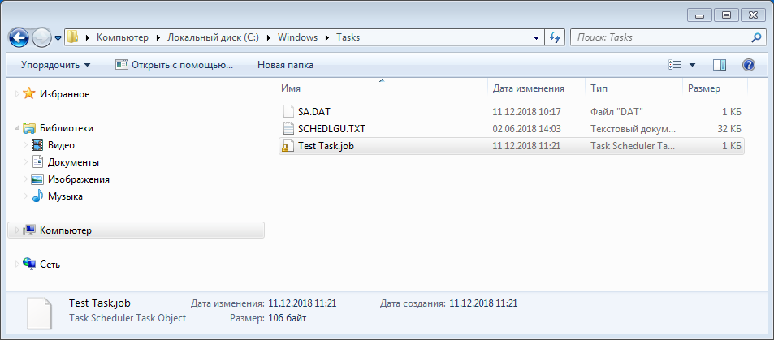

[C/C++ Code Example Creating a Task Using NewWorkItem - Windows applications | Microsoft Docs](https://docs.microsoft.com/en-us/windows/desktop/TaskSchd/c-c-code-example-creating-a-task-using-newworkitem)

